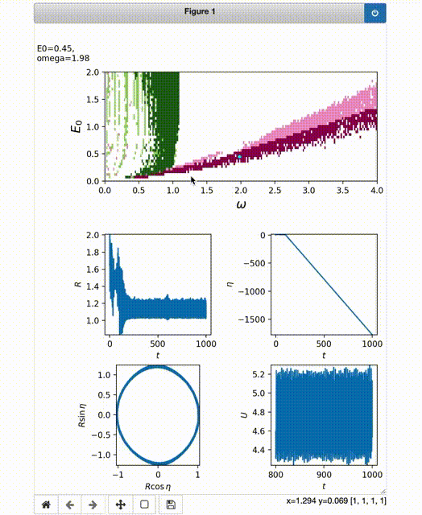

# Spacetime magnetic hopfions: from internal excitations and braiding of skyrmions

Ross Knapman<sup>1,2,3</sup>, Timon Tausendpfund<sup>1</sup>, Sebastián A. Díaz<sup>2,4</sup>, Karin Everschor-Sitte<sup>2,3</sup>

<sup>1</sup> *Institute of Physics, Johannes Gutenberg University Mainz, 55128 Mainz, Germany*  
<sup>2</sup> *Faculty of Physics, University of Duisburg-Essen, 47057 Duisburg, Germany*  
<sup>3</sup> *Center for Nanointegration Duisburg-Essen (CENIDE), University of Duisburg-Essen, 47057 Duisburg, Germany*  
<sup>4</sup> *Department of Physics, University of Konstanz, 78457 Konstanz, Germany*  

| Description | Badge |
| --- | --- |
| Paper | Pending |
| Paper DOI | Pending |
| Preprint | [](https://arxiv.org/abs/2305.07589) |
| Binder | Pending |
| License | Pending |
| Repository DOI | Pending |


## About

This repository contains the code for the micromagnetic simulations, collective coordinate approach, and the code to create the figures used in the manuscript arXiv 2305.07589 entitled “Spacetime magnetic hopfions: from internal excitations and braiding of skyrmions”. It also provides the data produced by the micromagnetic simulations as well as the collective coordinates from which the figures have been generated (as some of the simulations are extensive). A highlight of this repository is the interactive version of the phase diagram, Figure 3, in the manuscript, see The Jupyter notebook `CollectiveCoordinates/InteractivePhaseDiagram’.


## Filestructure Summary

- `Micromagnetics`
    - `ModifiedMumax3`
        - `Source` The modified source code of [MuMax3](https://github.com/mumax/3) with higher-order exchange and electric field.
        - `modified_mumax3_binary` The compiled modified MuMax3 binary required to run the micromagnetic simulations.
    - `SimulationsAndAnalysis`
        - `RunSimulations.sh` <ins>The only script the user should need to run to recreate the simulations. Generates the required MuMax scripts and runs them, then calls `AnalyseSimulations.py` to perform the analysis.</ins> Run from the directory in which it is contained using `./RunSimulations.sh`.
        - `MicromagneticsDataSupplied` The supplied micromagnetic data required for the plots. Each sub-directory has a name of the form `E0<E0 value>omega<omega value>`, within which the micromagnetic data is stored in `Data` and the extracted NumPy radius and helicity arrays are stored in `AnalysisResults`.
        - `AnalyseSimulations.py` Python script to calculate radius and helicity from micromagnetic data and render movies, run by `RunSimulations.sh`.
        - `MicromagneticParams` Parameters to be used in the micromagnetic simulations. Read by `RunSimulations.sh`.
        - `SimulationE0Omegas.txt` List of points $E_0$, $\omega$ values for which micromagnetic simulations are run. Read by `RunSimulations.sh`.
        - `Template.mx3` MuMax3 boilerplate code, for which the specific values are replaced when `RunSimulations.sh` is run and the simulation script is added to the appropriate directory.
        - `GeneralMicromagneticAnalysisTools`: Copy of my [MicromagneticAnalysisTools](https://github.com/RossKnapman/MicromagneticAnalysisTools) library, with irrelevant functions removed.
- `CollectiveCoordinates`
    - `CollectiveCoordinateIntegration` 
        - `CollectiveCoordinateDataSupplied` The supplied collective coordinate integration data required for the plots.
        - `CCIntegration.sage` The SageMath script used to perform the time integrations of the collective coordinates and output them as NumPy Arrays.
        - `Fit.c` C function called by the SageMath script to calculate the time derivatives of the collective coordinates. Must be compiled before running the SageMath Script.
    - `InteractivePhaseDiagram.ipynb` Interactive phase diagram as described below.
    - `CreateCollectiveCoordinateMovies.py` Script to render energy landscape and POV-Ray render of skyrmion motion.
- `JupyterNotebookForFigures` Jupyter notebook to reproduce the figures in the manuscript.
- `Utils`
    - Library of Python functions used in the data analysis, called from other scripts above.


## Interactive Phase Diagram

The Jupyter notebook `CollectiveCoordinates/InteractivePhaseDiagram.ipynb` creates an interactive version of Figure 3 of the manuscript, for which the collective coordinate evolution and energy evolution can be seen for all points by clicking on them.




## Supplied Data

### Collective Coordinate Integration

The `NumPy` arrays of the skyrmion radius $R$ and the helicity $\eta$ are for each point in the phase diagram are in `CollectiveCoordinates/CollectiveCoordinateDataSupplied`. Within this directory, the directory `R` contains the radius arrays and `eta` contains the helicity arrays. The names are structured as E0<E0 value>omega<omega value>.npy. Additionally supplied in the `General` directory is `CCParams.txt`, which includes the parameters used in the simulation (magnetic field and domain wall width), the fit parameters, and the skyrmion radius that minimises energy in the absence of an electric field, which are required for some of the data analysis. `General` also contains the array of (dimensionless) times for the collective coordinate integration, `times.npy`. Furthermore, also included in `CollectiveCoordinateDataSupplied` are the arrays used to calculate the phase diagrams, as 2D arrays, used in the plotting of the phase diagrams in Figure 3, Supplementary Figure 2, and Supplementary Figure 3, in the subdirectory `PhaseDiagramData`.


### Micromagnetic Simulations

The micromagnetics data as OVF files used in the manuscript are stored in `Micromagnetics/SimulationsAndAnalysis/MicromagneticsDataSupplied/E0<E0 value>omega<omega value>/Data` for the two $E_0$ and $\omega$ values shown in the manuscript. Their extracted radii and helicities as a function of time are stored in each `Micromagnetics/SimulationsAndAnalysis/MicromagneticsDataSupplied/E0<E0 value>omega<omega value>/AnalysisResults`.


## Reproducing the Figures

The `JuptyerNotebooksForFigures` directory contains a sub-directory for each figure in the manuscript (excluding the illustrative Figure 1), each of which contains a Jupyter notebook to produce each figure. The notebooks as supplied read the supplied, pre-computed data.


## Rendering Movies for Collective Coordinate Evolution

The code used to produce the movies in the manuscript's supplementary information can be run for any of the points shown in the phase diagram using the script `CollectiveCoordinates/CreateCollectiveCoordinateMovies.py`. The values of $E_0$ and $\omega$ for which to create the movies are defined in the `parameter_pairs` list. The rendered movies will be output to a newly-created `CollectiveCoordinates/Movies` directory.


## Reproducing the Collective Coordinate Integrations

The integration is performed using the `SageMath` script `CollectiveCoordinates/CollectiveCoordinateIntegration/CCIntegration.sage`, which first performs fitting of various quantities as a function of skyrmion radius $R$ (such as the exchange force $F_{\mathrm{ex}} = - \mathrm{d}U / \mathrm{d}R$), then integrates for the different values of $E_0$ and $\omega$ in the phase diagram. `multiprocessing` is used to parallelise this. Additionally, the `SageMath` script calls a `C` function in `Fit.c` in the same directory, which must be compiled using
```
gcc -fPIC -shared -o c_fit.o Fit.c
```
before `CCIntegration.sage` is run (by calling `sage CCIntegration.sage` from the directory containing the SageMath script).


## Reproducing the Micromagnetic Simulations

The MuMax3 calculations can be reproduced using `Micromagnetics/SimulationsAndAnalysis/RunSimulations.sh`. This reads the values of $E_0$ and $\omega$ specified in `Micromagnetics/SimulationsAndAnalysis/SimulationE0Omegas.txt` for which simulations are to be run defined in `Micromagnetics/SimulationsAndAnalysis/MicromagneticParams` and runs the MuMax3 simulations, outputting their results to the directory `Micromagnetics/SimulationsAndAnalysis/MicromagneticsData/E0<E0 value>omega<omega value>/Data` for each $E_0$ and $\omega$. It then runs calls the script `AnalyseSimulations.py`, which calculates helicities and radii from the micromagnetics, and outputs them to `Micromagnetics/MicromagneticsData/E0<E0 value>omega<omega value>/AnalysisResults`, as well as rendering a movie in that directory of the evolution of the magnetization texture.
